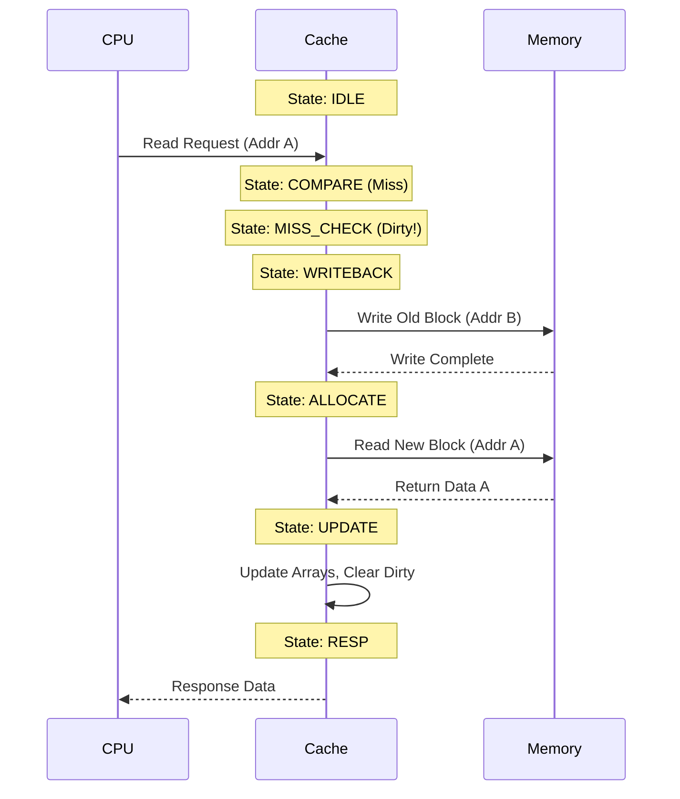

# Single-Level Cache Memory System: Detailed Documentation

> **For Lab Record & Viva Preparation (EL-1)**

## 1. Introduction to Cache Memory

### What is Cache Memory?

Cache memory is a small, high-speed memory positioned between the CPU and main memory (RAM). It stores copies of frequently accessed data to reduce the average time required to access data from the slower main memory.

### Why is it Needed?

- **The "Memory Wall"**: CPU speeds have increased much faster than memory speeds. A modern CPU can execute billions of instructions per second, but fetching data from RAM takes 100+ CPU cycles.
- **Performance Impact**:
  - _Without cache_: CPU waits ~100 cycles for each memory access.
  - _With cache hit_: CPU waits ~1-2 cycles.
  - _Result_: Identifying and serving frequent data from cache dramatically speeds up execution.

### Locality of Reference

Caches work because of two fundamental properties of programs:

1.  **Temporal Locality**: If data is accessed, it will likely be accessed again soon (e.g., loop counters, variables).
2.  **Spatial Locality**: If data at address `X` is accessed, data at `X+1`, `X+2` will likely be accessed soon (e.g., array traversal, sequential code execution).

---

## 2. Architecture: Direct-Mapped Cache

This project implements a **Direct-Mapped Cache**. In this organization, each memory address maps to **exactly one** specific location (set) in the cache.

### Mapping Logic

$$ \text{Set Index} = (\text{Address} / \text{Block Size}) \pmod{\text{Number of Sets}} $$

- **Advantages**: Simplest hardware, fastest lookup (only one place to check), lowest power.
- **Disadvantages**: **Conflict Misses**. If two frequently accessed addresses map to the same set, they evict each other repeatedly (thrashing).

---

## 3. Design Parameters

The system is parameterizable (defined in `rtl/cache_pkg.v`), but the default configuration for this lab is:

| Parameter          | Value          | Description                                                      |
| :----------------- | :------------- | :--------------------------------------------------------------- |
| **Address Width**  | 32 bits        | Standard CPU address size.                                       |
| **Cache Size**     | 1 KB           | Small size chosen for easier simulation analysis.                |
| **Block Size**     | 32 bytes       | 256 bits per line. Exploits spatial locality.                    |
| **Number of Sets** | 32             | $1024 \text{ bytes} / 32 \text{ bytes/block} = 32 \text{ sets}$. |
| **Associativity**  | 1 (Direct)     | Each address maps to 1 set.                                      |
| **Write Policy**   | Write-Back     | Memory only updated on eviction.                                 |
| **Alloc. Policy**  | Write-Allocate | Write misses bring block into cache.                             |

---

## 4. Address Breakdown

A 32-bit address is split into three parts to navigate the cache:

```
  31                     10 9           5 4           0
 ┌─────────────────────────┬─────────────┬─────────────┐
 │           TAG           │    INDEX    │   OFFSET    │
 │         22 bits         │   5 bits    │   5 bits    │
 └─────────────────────────┴─────────────┴─────────────┘
```

1.  **OFFSET (5 bits)**: Selects the specific byte within the 32-byte block.
    - Bits [1:0] select the byte.
    - Bits [4:2] select the 32-bit word.
2.  **INDEX (5 bits)**: Selects one of the 32 sets ($2^5 = 32$). The cache controller uses this to address the internal arrays.
3.  **TAG (22 bits)**: The remaining upper bits. Stored in the cache line to identify _which_ memory block is currently sitting in that set.

**Example**: Address `0x0000_04A8`

- Binary: `...000001` (Tag) `00101` (Index) `01000` (Offset)
- Action: Look in **Set 5**. Check if stored Tag matches `0x000001`. If yes, access Byte 8.

---

## 5. Cache Line Structure

Each of the 32 sets in the cache contains a single "line" with the following structure:

| Field     | Width    | Description                                                                                                        |
| :-------- | :------- | :----------------------------------------------------------------------------------------------------------------- |
| **VALID** | 1 bit    | `1` indicates the line contains valid data. `0` on reset.                                                          |
| **DIRTY** | 1 bit    | `1` indicates the data has been modified (written to) and differs from main memory. Crucial for Write-Back policy. |
| **TAG**   | 22 bits  | Stores the upper bits of the address for identity verification.                                                    |
| **DATA**  | 256 bits | The actual 32 bytes of data.                                                                                       |

**Code Representation**:

```verilog
reg                     valid_arr [0:31];
reg                     dirty_arr [0:31];
reg [21:0]              tag_arr   [0:31];
reg [255:0]             data_arr  [0:31];
```

---

## 6. Detailed Code Explanations

### FSM Controller (`direct_mapped_cache.v`)

The heart of the cache is a Finite State Machine (FSM). Here is exactly what happens in each state:

| State          | Logic & Action                                                                                                                                                                                  |
| :------------- | :---------------------------------------------------------------------------------------------------------------------------------------------------------------------------------------------- |
| **IDLE**       | Waits for `cpu_req`. When asserted, latches inputs (`latched_addr`, `latched_wdata`) and moves to `COMPARE`.                                                                                    |
| **COMPARE**    | Checks for Hit/Miss. <br> `Hit = Valid && (Stored_Tag == Request_Tag)` <br> If Hit → **HIT** state. <br> If Miss → **MISS_CHECK** state.                                                        |
| **HIT**        | **Read**: Returns data immediately (`cpu_rdata`). <br> **Write**: Updates cache array and sets `dirty_arr[index] = 1`. <br> Moves to `RESP`.                                                    |
| **MISS_CHECK** | Checks if the current occupant (victim) is dirty. <br> If `dirty == 1` → Must save to memory first → **WRITEBACK_INIT**. <br> If `dirty == 0` → Safe to overwrite → **ALLOCATE_INIT**.          |
| **WRITEBACK**  | Writes the _old_ (victim) block to Main Memory. Uses `tag_arr[index]` to reconstruct the old address.                                                                                           |
| **ALLOCATE**   | Reads the _new_ block from Main Memory at the requested address.                                                                                                                                |
| **UPDATE**     | Installs the new block into cache arrays: <br> `valid=1`, `tag=new_tag`, `data=fetched_data`. <br> **Read Miss**: `dirty=0`. <br> **Write Miss**: Modifies data immediately and sets `dirty=1`. |
| **RESP**       | Asserts `cpu_resp` to tell the CPU the request is done.                                                                                                                                         |

### Helper Functions

**`get_word`**: Extracts a 32-bit word from the 256-bit block.

```verilog
// Selects bits based on word_offset (0-7)
// e.g., if offset is 1, returns block[63:32]
case (word_sel)
    3'd0: get_word = block[31:0];
    ...
```

**`set_word`**: Writes a 32-bit word into the 256-bit block, respecting byte strobes.

- **Byte Strobes (`wstrb`)**: Allow writing specific bytes (e.g., `1100` writes upper 2 bytes).
- **Logic**: `new_byte = strobe ? new_data : old_data`
  - This preserves bytes that shouldn't be touched.

---

## 7. Operations Walkthrough

### 7.1 Read Hit

1.  **Index** points to set. **Tag** matches. **Valid** is 1.
2.  Data is extracted from `data_arr` using offset.
3.  Returned to CPU. Time: ~2-3 cycles.

### 7.2 Read Miss (Clean)

1.  Tag mismatch.
2.  Victim is clean (`dirty=0`). No writeback needed.
3.  **Allocate**: Fetch new block from Memory.
4.  **Update**: Write new block to `data_arr`, update `tag_arr`.
5.  Return data. Time: ~8 cycles.

### 7.3 Read Miss (Dirty) - The "Expensive" Case

1.  Tag mismatch.
2.  Victim is dirty (`dirty=1`). **Data loss risk!**
3.  **Writeback**: Send victim data & old address to Memory. Wait for Ack.
4.  **Allocate**: Fetch new block.
5.  **Update**: Overwrite victim.
6.  Return data. Time: ~14+ cycles.

### 7.4 Write Hit (Write-Back)

1.  Tag match.
2.  **Update**: Modify data in `data_arr`.
3.  **Set Dirty**: `dirty_arr[index] = 1`.
4.  **Main Memory is NOT updated**. This saves bandwidth.

### 7.5 Write Miss (Write-Allocate)

1.  Tag mismatch.
2.  Perform Writeback if needed.
3.  **Fetch**: Read the _entire_ 32-byte block from memory (even if we only want to write 4 bytes).
    - _Why?_ We need the surrounding bytes to have a valid cache line.
4.  **Modify**: Update the specific word in the fetched block.
5.  **Install**: Write to cache and set `dirty=1`.

---

## 8. Timing Diagrams

### Read Miss with Dirty Eviction

_The most complex scenario showing FSM transitions._



---

## 9. Common Viva Questions

**Q1: What is the difference between Write-Back and Write-Through?**

- **Write-Through**: Every write is sent to _both_ cache and main memory. Safe, but slow (bus traffic).
- **Write-Back**: Write only to cache (set dirty bit). Memory is updated only when the block is modified. Faster, but complex.

**Q2: What is "Thrashing"?**

- In a direct-mapped cache, if two frequently used variables map to the _same set_, they constantly evict each other. This destroys performance. Increasing Associativity (2-way, 4-way) solves this.

**Q3: Why "Write-Allocate" for write misses?**

- Standard pair for Write-Back. It assumes if you write to a location, you will likely read/write it again soon (Spatial Locality). So, we bring the block into cache immediately.

**Q4: How does this design handle partial writes (e.g., writing a single byte)?**

- Using the `cpu_wstrb` (Write Strobe) signal. The controller reads the existing word, replaces only the bytes where `wstrb` is 1, and writes the merged result back.

**Q5: What is a Compulsory Miss?**

- The very first time you access a block, it cannot be in the cache. This miss is unavoidable.
