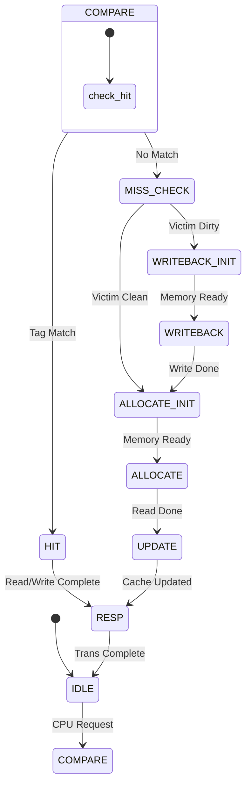
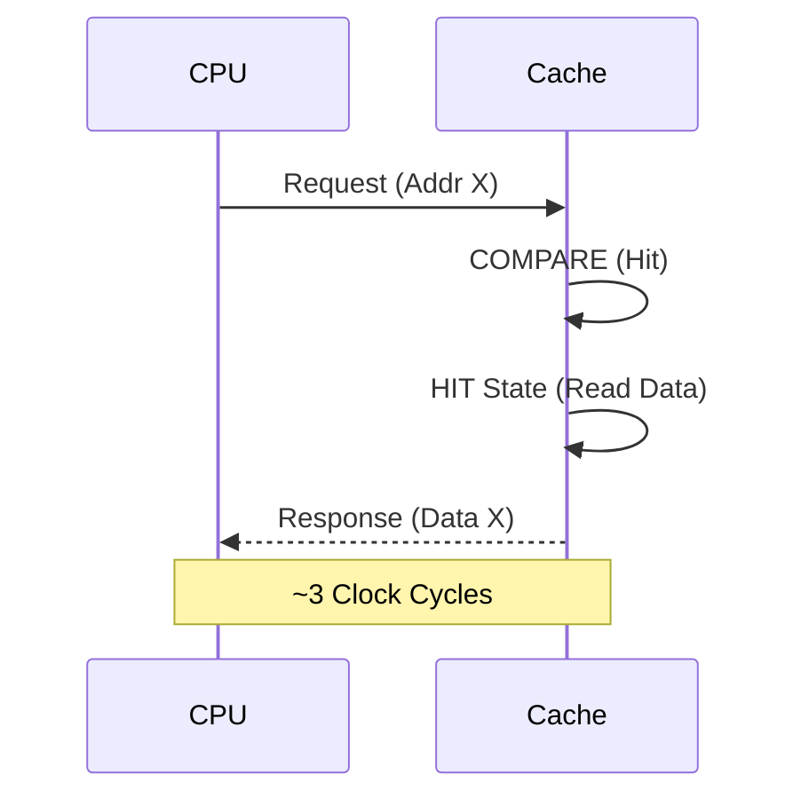
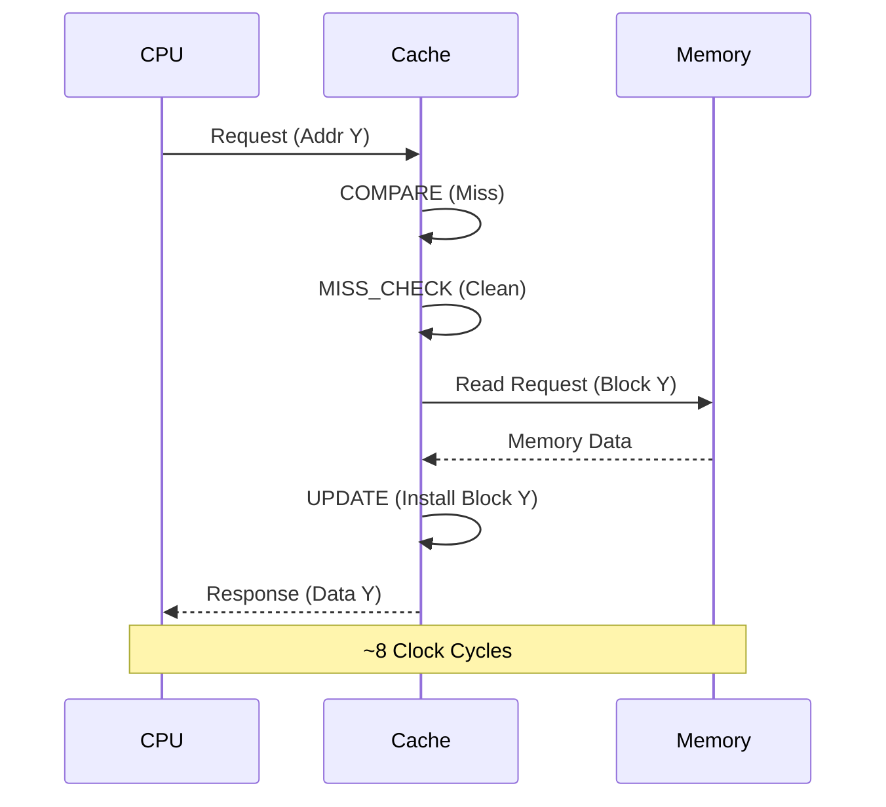
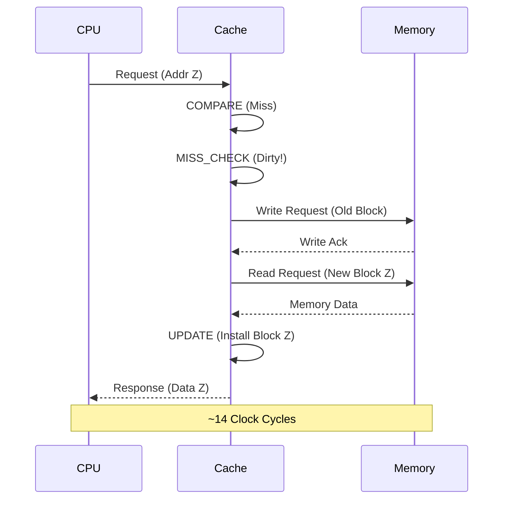

# Cache Design Documentation

This document portrays the internal architecture and logic of the Direct-Mapped Cache System.

## 🧠 Finite State Machine (FSM)

The cache controller is driven by a Finite State Machine that handles CPU requests and coordinates with Main Memory.

### State Diagram

### State Descriptions

| State            | Description                                                                                                 |
| :--------------- | :---------------------------------------------------------------------------------------------------------- |
| **S_IDLE**       | Waiting for a request from the CPU. `cpu_ready` is high.                                                    |
| **S_COMPARE**    | Checks the tag array to determine if the requested address is a specific **Hit** or **Miss**.               |
| **S_HIT**        | Data is immediately read from or written to the cache block. Dirty bit is set on writes.                    |
| **S_MISS_CHECK** | On a miss, checks if the block currently occupying the set (the "victim") has modified data (`dirty == 1`). |
| **S_WRITEBACK**  | Writes the dirty victim block back to main memory to carry consistency.                                     |
| **S_ALLOCATE**   | Fetches the new memory block from main memory to replace the victim.                                        |
| **S_UPDATE**     | Installs the new block into the cache arrays (Tag, Data, Valid).                                            |
| **S_RESP**       | Signals completion to the CPU by asserting `cpu_resp`.                                                      |

---

## ⏱️ Timing Diagrams

### 1. Read Hit

_Fastest path: Data is returned almost immediately._

### 2. Read Miss (Clean Victim)

_Standard miss: Fetch new block from memory._

### 3. Read Miss (Dirty Victim)

_Slowest path: Write back old data, then fetch new data._

---

## 🧪 Test Cases

The testbench (`tb_cache_system.v`) verifies the following scenarios:

| Test  | Name                  | Description                                                                                            |
| :---: | :-------------------- | :----------------------------------------------------------------------------------------------------- |
| **A** | **Compulsory Miss**   | Accessing a block for the first time (Miss), then accessing it again (Hit).                            |
| **B** | **Conflict Miss**     | Accessing two different addresses that map to the same set index, forcing eviction.                    |
| **C** | **Write Hit (WB)**    | Writing to a block already in cache. Verifies that memory is **not** immediately updated (Write-Back). |
| **D** | **Dirty Eviction**    | Forcing eviction of a dirty block to ensure the controller Writes it Back to memory.                   |
| **E** | **Write Miss (WA)**   | Writing to an address not in cache. Verifies the block is fetched first (Write-Allocate).              |
| **G** | **Sequential Access** | Accessing consecutive memory blocks to test general stability.                                         |

---
